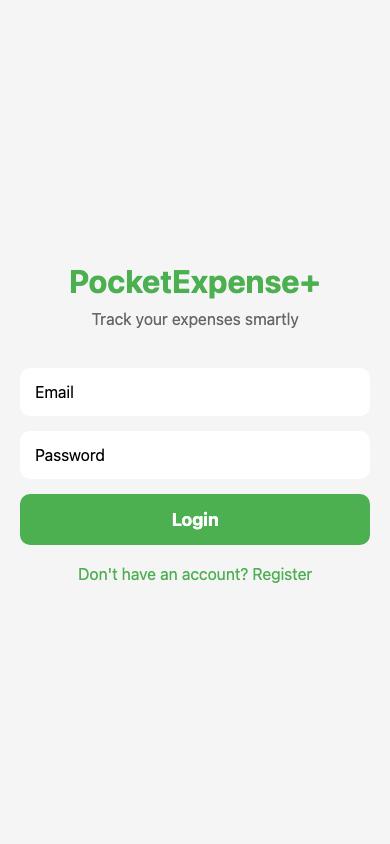
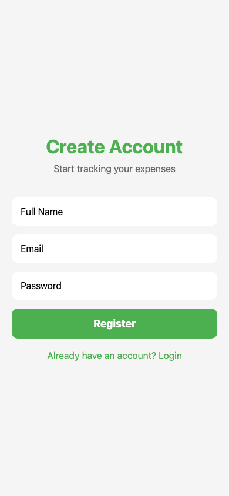
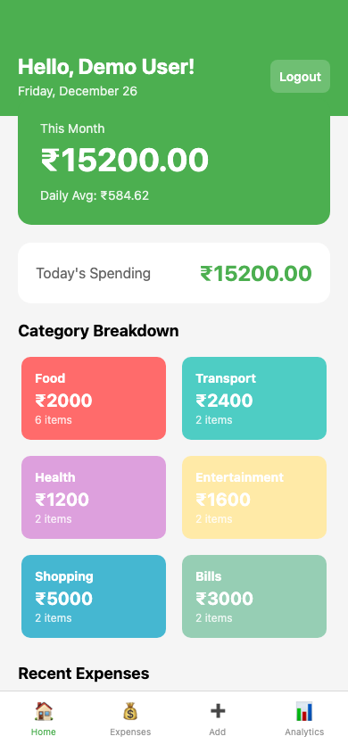
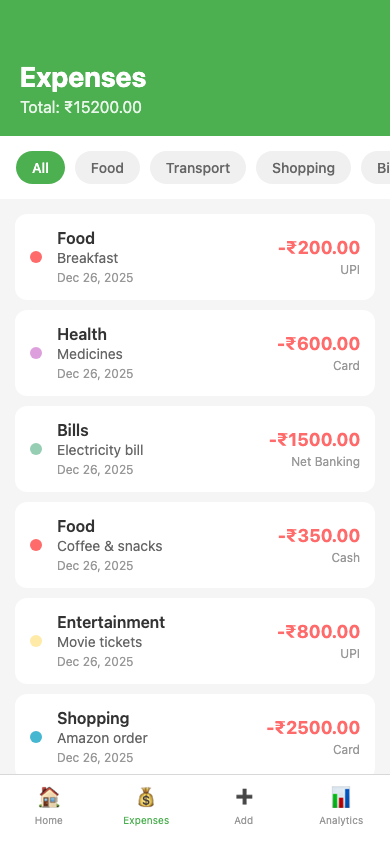
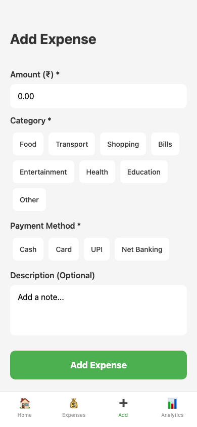
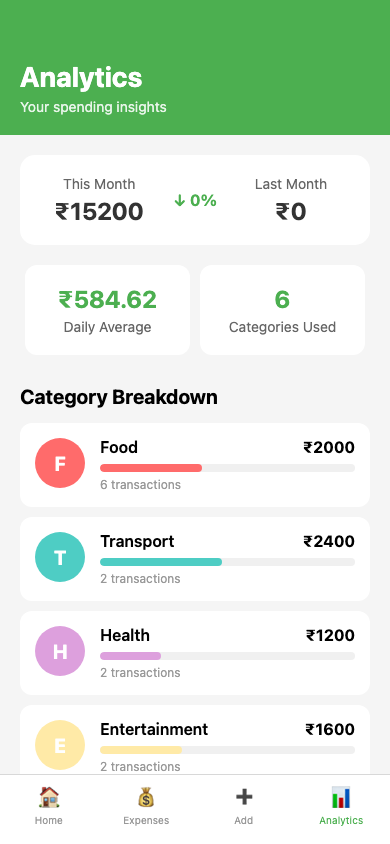

# PocketExpense+

A full-stack expense tracking mobile application built with React Native (Expo) and Node.js.

## Features

- **User Authentication** - Register, Login, JWT-based auth
- **Expense Management** - Add, Edit, Delete expenses
- **Categories** - Food, Transport, Shopping, Bills, Entertainment, Health, Education, Other
- **Payment Methods** - Cash, Card, UPI, Net Banking
- **Analytics Dashboard** - Monthly spending, category breakdown, insights
- **Offline Support** - Expenses saved locally when offline, synced when online
- **Pull to Refresh** - Real-time data updates

## Tech Stack

### Frontend
- React Native (Expo)
- React Navigation (Stack + Bottom Tabs)
- Context API for state management
- AsyncStorage for offline storage
- Axios for API calls

### Backend
- Node.js + Express.js
- MongoDB + Mongoose
- JWT Authentication
- bcryptjs for password hashing

## Project Structure

```
PocketExpense/
├── backend/
│   ├── models/
│   │   ├── User.js
│   │   └── Expense.js
│   ├── routes/
│   │   ├── auth.js
│   │   └── expenses.js
│   ├── middleware/
│   │   └── auth.js
│   ├── server.js
│   ├── .env.example
│   └── package.json
└── frontend/
    ├── src/
    │   ├── context/
    │   │   ├── AuthContext.js
    │   │   └── ExpenseContext.js
    │   ├── services/
    │   │   └── api.js
    │   └── screens/
    │       ├── LoginScreen.js
    │       ├── RegisterScreen.js
    │       ├── HomeScreen.js
    │       ├── ExpensesScreen.js
    │       ├── AddExpenseScreen.js
    │       └── AnalyticsScreen.js
    ├── App.js
    └── package.json
```

## Setup Instructions

### Prerequisites
- Node.js (v14+)
- MongoDB (local or Atlas)
- Expo CLI (`npm install -g expo-cli`)
- Expo Go app on your phone

### Backend Setup

1. Navigate to backend folder:
   ```bash
   cd backend
   ```

2. Install dependencies:
   ```bash
   npm install
   ```

3. Create `.env` file:
   ```bash
   cp .env.example .env
   ```

4. Update `.env` with your MongoDB URI:
   ```
   PORT=5000
   MONGODB_URI=mongodb://localhost:27017/pocketexpense
   JWT_SECRET=your_secret_key_here
   ```

5. Start the server:
   ```bash
   npm run dev
   ```

### Frontend Setup

1. Navigate to frontend folder:
   ```bash
   cd frontend
   ```

2. Install dependencies:
   ```bash
   npm install
   ```

3. Update API URL in `src/services/api.js`:
   ```javascript
   const API_URL = 'http://YOUR_LOCAL_IP:5000/api';
   ```
   > Find your IP: `ipconfig` (Windows) or `ifconfig` (Mac/Linux)

4. Start Expo:
   ```bash
   npx expo start
   ```

5. Scan QR code with Expo Go app

## API Endpoints

### Authentication
| Method | Endpoint | Description |
|--------|----------|-------------|
| POST | `/api/auth/register` | Register new user |
| POST | `/api/auth/login` | Login user |
| GET | `/api/auth/me` | Get current user |

### Expenses
| Method | Endpoint | Description |
|--------|----------|-------------|
| GET | `/api/expenses` | Get all expenses |
| POST | `/api/expenses` | Create expense |
| PUT | `/api/expenses/:id` | Update expense |
| DELETE | `/api/expenses/:id` | Delete expense |
| GET | `/api/expenses/analytics` | Get analytics |
| GET | `/api/expenses/category/:cat` | Filter by category |
| POST | `/api/expenses/sync` | Sync offline expenses |

## Screenshots

### Authentication
| Login | Register |
|-------|----------|
|  |  |

### Main Screens
| Home | Expenses |
|------|----------|
|  |  |

### Add & Analytics
| Add Expense | Analytics |
|-------------|-----------|
|  |  |

## Key Implementation Details

### JWT Authentication
- Token stored in AsyncStorage
- Auto-attached to API requests via Axios interceptor
- Protected routes in backend using auth middleware

### Offline Support
- Failed expense additions saved to AsyncStorage
- Auto-sync when app comes online
- Offline indicator shown on home screen

### State Management
- AuthContext: User authentication state
- ExpenseContext: Expenses and analytics data
- Both contexts provide loading states and error handling

## Author

Built for Scaler React Native Assignment
